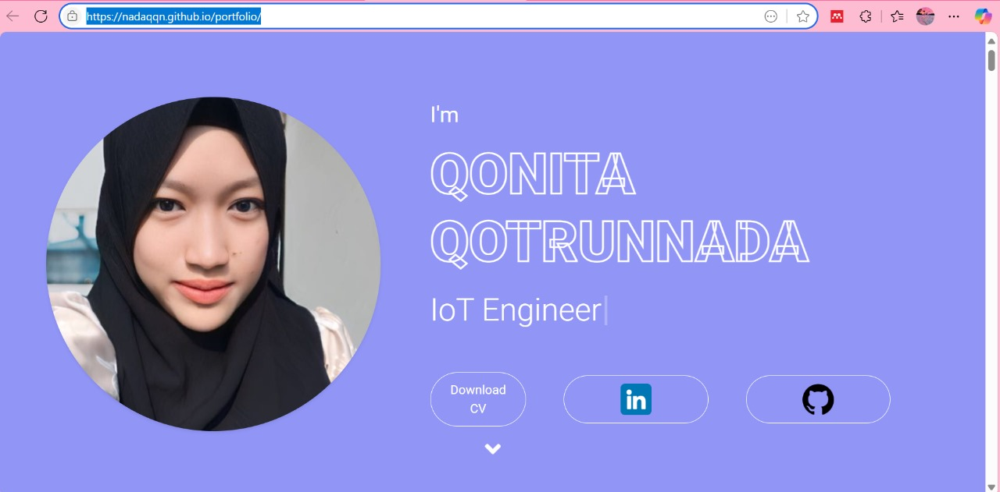

# 🌐 Personal Portfolio Website

Hi there! 👋  
Welcome to the repository of my personal portfolio website — a digital window into who I am, what I do, and what I’ve built. 🎯

---

## 🧭 What's Inside?

This website was created to showcase **who I am** and **what I offer** as an individual in the tech world. Here's what you’ll find inside:

- 📄 **CV / Resume** – My academic and professional journey.
- 💼 **Professional Profiles** – Quick links to my LinkedIn and other platforms.
- 📬 **Contact Info** – Easily reach out via email.
- 🧑‍💻 **About Me** – A short story about my background and passions.
- 🎓 **Education History** – Institutions and programs I’ve completed.
- 🛠️ **Skills** – The tools, technologies, and techniques I’m skilled in.
- 🧩 **Services** – Things I can help you with or projects I can take on.
- 🏅 **Certifications** – Official recognitions I’ve earned.
- 🖼️ **Gallery** – A curated collection of activities and projects I’ve worked on.

---

## 🚀 Purpose of This Website

I built this site to:

- Showcase my growth as a developer 📈  
- Provide easy access to my work and credentials 🗂️  
- Help collaborators or recruiters learn more about me 👀  
- Serve as a central hub for all things *me* 🌟

---

## 💻 Tech Stack

Built with:

- 🌐 HTML, CSS, JavaScript
- 🎨 Responsive and clean UI design
- 🧩 Modular code structure for scalability
- 📱 Mobile-friendly interface

---

## 📸 Preview

Check out the live version here: [🔗 https://nadaqqn.github.io/portfolio/)

---

## 🤝 Let's Connect!

If you're curious about my work, have a project idea, or just want to chat, don’t hesitate to reach out!

- 💌linktree: https://linktr.ee/qonitaqq 

---

> *“Design is not just what it looks like and feels like. Design is how it works.”* – Steve Jobs ✨

---

Thank you for stopping by! 🌿  
Feel free to ⭐️ this repo if you like it or want to come back later.
